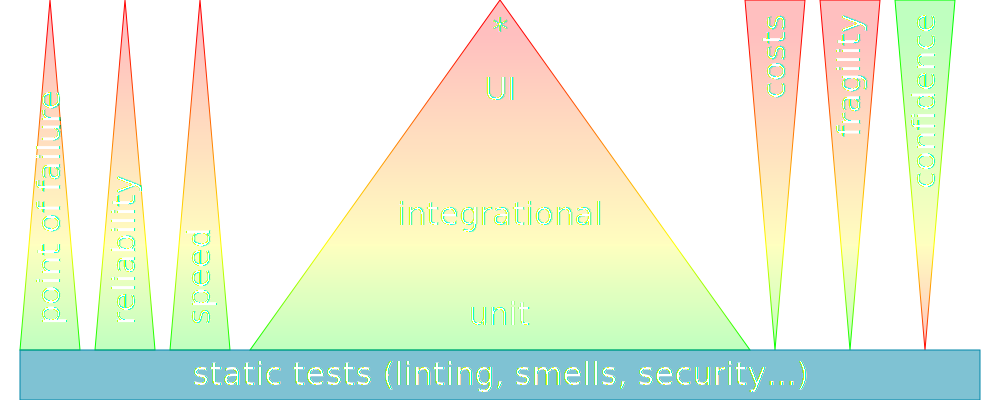
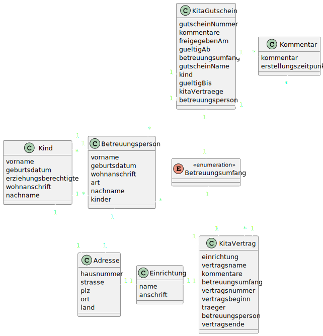

= Testdaten
Mariano Mertinat <Mariano.Mertinat@novatec-gmbh.de>
3.0, July 29, 2022: AsciiDoc article template
:toc:
:icons: font
:url-quickref: https://docs.asciidoctor.org/asciidoc/latest/syntax-quick-reference/
:srcdir: ../../src
:testdir: ../../src/test/java/
:source-highlighter: highlight.js
:customcss: ./custom.css
:revealjs_hash: true
:revealjs_respondToHashChanges: true
:revealjs_transition: slide
:revealjs_backgroundTransition: fade
:revealjs_theme: black
:revealjs_totalTime: 1800
:revealjs_history: true
:revealjs_mouseWheel: false
:revealjs_navigationMode: default

Eine Reise für faule Entwickler und robuste, schlanke Tests

== Agenda

== Why Tests
[.placeHigher]
image::https://images.squarespace-cdn.com/content/v1/518f5d62e4b075248d6a3f90/1571602440714-B1XDU7TSFOGQDOE9VL56/coverage.png?format=2500w[Geek and poke - QA best Practices, 525vw]

=== Reliable Speed
image::https://drek4537l1klr.cloudfront.net/khorikov/Figures/01fig02_alt.jpg[Progress Speed,500vw]

[.notes]
****
Entwickler werden langsamer je nach Qualität von Tests

* Keine Tests besonders langsam
* Schlechte tests langsamer
* gute Tests= Konstant
****

=== Costs
image::https://ambysoft.com/wp-content/uploads/2023/03/comparingTechniques.jpg[costs,500vw]

[.notes]
****
* Kosten Steigen über die Zeit.
* Zehner Regel pro Schritt
****

== Testdata
[.placeHigher]
--
image::https://images.squarespace-cdn.com/content/v1/518f5d62e4b075248d6a3f90/1375007884089-OD2T9RAMF0FXDH6J7SZ7/tdd.jpg?format=2500w[geek and poke TDD,450iw]
--

=== Scope

[.notes]
****
* Viel zu viele Testarten
** System
** End to End
** Component
** Integration
** Unit
** Accteptance
** Performance
** Usability
** Security/Pen Tests
** end more
* alle werden unterschiedlich verstanden/interprätiert
* Selbst der einfachste Fall: Was ist ein Unittest?
* Entscheidend: Höhere Ebenen = Geringere Anzahl
****

=== Kinds
Statisch vs. Dynamisch

[%step]
Fachlich vs. Technisch

[%step]
Prod: real vs. pseudonomized vs. alike

[%step]
\... vs. ... vs. ...

[.notes]
****
* Statisch vs. Dynamisch
** Statisch = Festes immergleiches Datenset
*** Geeignet für Tests höherer Ebenen
*** Nachvollziehbarkeit
** Dynamisch
*** Niedrigere Testebenen
*** Flexibilität
* Fachliche Korrektheit vs. Technische Korrektheit
** Fachlich
*** Akzeptanztests
** Technisch
*** Technische Grenzfälle
* Prod
** Perfect für Fehlerreproduktion
** Aber:
*** Groß
*** Stehen erst spät zur Verfügung (system da)
*** Datenschutzprobleme
**** ggf. Auch bei pseudonymisierten Daten wenn Freitexte erlaubt
*** Production Like aufwändig in Pflege
* Andere e.g.
** Snapshottests
** backend vs. frontend vs. api
** u.v.m soll hier im Einzelnen nicht kümmern.
****

== Evolution
[.fade-out%step]
Am Anfang war das Model ...

[.placeHigher2.fade-in%step]

// [NOTE.speaker]
[.notes]
****
Am Anfang war das Model...

* Vergleichsweise einfaches Modell
* Zirkelbeziehungen
** der einfachheit nur eine
* Datenzentriert => Table Module
****

=== pro Testmethode
// todo Bring den Spaß Plain Reveal um Zeilen highlighten zu können ... das is ja furchtbar  ... vlt. noch mit Markdown Syntax für Lesbarkeit
#todo Bring den Spaß Plain Reveal um Zeilen highlighten zu können ... das is ja furchtbar  ... vlt. noch mit Markdown Syntax für Lesbarkeit#

[source,java]
----
include::{srcdir}/test/java/io/marmer/github/demo/novatecsummit2023demo/application/CommonGutscheinTypeServiceImplManagerHelperUtilObjectImplTest.java[tag=perMethod]
----

[.notes]
****
* Viele Felder zu setzen - In jeder Methode aufs Neue
** Keinen Überblick über Relevante Felder (hier tatsächlich nur das Feld Freigeben)
** Viele Tests bei Modelländerungen anzupassen
** Test insgesamt nur schwer zu verstehen
** Fehlerpotential durch z.B.
*** Mehrfachsetzung
*** Copy Paste Fehler
* ...
****

=== Mock
[source,java]
----
include::{srcdir}/test/java/io/marmer/github/demo/novatecsummit2023demo/application/CommonGutscheinTypeServiceImplManagerHelperUtilObjectImplTest.java[tag=mockedTestdata]
----

[.notes]
****
// ** TODO Was hat sich verbessert
// TODO Was sind nun die Probleme und was bleibt?
****

=== pro Testklasse
=== pro Modul oder Repository
=== Blueprint
=== Real Random Value Manual
=== Seeded Random Value Manual
=== Seeded Random Structures Manual
=== Seeded Random Structures With Semantics
=== Bonus Builder Pattern
=== on DDD Aggregates or Domain Entities (which are not anemic)
* Either Iterate through the processes ( you have to do it anyway sooner or later)
* Use Test Builders

[.notes]
****
* Iterate through the processes
** You have to do it anyway
*
****

== Libraries

* <<lib_fake_daten, Fake Daten>>
* <<lib_complexTypes, Komplexe Typen>>
* <<lib_property-based-testing, property-based-testing>>
* <<lib_server, server>>
* <<lib_datenbanken, datenbanken>>

[.columns]
=== Fake Daten [[lib_fake_daten]]

[.column]
--
Java/Kotlin

* https://github.com/DiUS/java-faker[java-faker], https://github.com/paraseba/faker[faker], https://github.com/Devskiller/jfairy[jFairy]footnote:[not maintained], https://github.com/andygibson/datafactory[datafactory]
* https://github.com/serpro69/kotlin-faker[kotlin-faker]
* ...
--

[.column]
--
JS/TS

* https://www.npmjs.com/package/@faker-js/faker[@faker-js/faker]footnote:[Achtung: Nicht verwechseln mit Skandalprojekt 'faker'! Siehe: https://heise.de/-6322366], https://www.npmjs.com/package/casual[casual]
* https://www.npmjs.com/package/jabber[jabber]
* ...
--

[.notes]
****

* Java/Kotlin
** Unzählige Libs mit Faker im Namen. Einige nicht mehr gewartet
* JS/TS
** Faker = Skandalprojekt
*** Unbrauchbarmachung
*** Löschung
*** Communityprojekt
** casual
** Jabber
*** Ganze Texte
****

[.columns]
=== Komplexe Typen [[lib_complexTypes]]

[.column]
--
Java/Kotlin

* https://github.com/j-easy/easy-random[easy-random] footnote:[aka. RandomBeans aka. JPopulator]
* https://www.instancio.org/[Instancio]
* https://mtedone.github.io/podam/[Podam]
--

[.column]
--
JS/TS

* https://github.com/tool-belt/interface-forge[interface-forge]
* https://www.npmjs.com/package/factory.ts[factory.ts]
* https://www.npmjs.com/package/mocker-data-generator[mocker-data-generator]
--

[.notes]
****
* Java/Kotlin
** easy-random
*** inzwischen leider im Maintainance mode, aber sehr stabil und konfigurabel
** podam
*** Spielt scheinbar in einer ähnlichen Liga wie easy-random
** Instancio
*** Moderner Ansatz
* JS/TS
** Die ersten beiden TS only - Interface basiert
** Letzte Schemabasiert
****

[.columns]
=== Property-Based-Testing [[lib_property-based-testing]]
[.column]
--
Java/Kotlin

** https://jqwik.net[jqwik]
** https://github.com/pholser/junit-quickcheck[Junit QuickCheck]
--

[.column]
--
JS/TS

** https://github.com/dubzzz/fast-check[fast-check]
** https://github.com/jsverify/jsverify[jsverify]
--

[.notes]
****
[%hardbreaks]
Spannendes Konzept.
Aber noch keine persönlichen Erfahrungen damit gemacht
****

=== Server [[lib_server]]
* https://www.mock-server.com/[MockServer]footnote:testcontainer[Dank Docker und Testcontainers sprachunabhängig]
* https://wiremock.org/docs/getting-started[WireMock]footnote:testcontainer[]
* https://www.mockaroo.com/[Mockaroo API]

[.notes]
****
Mocken ganzer APIs. Danke Testcontainers ist einiges
****

=== Datenbanken [[lib_datenbanken]]

* https://www.dbunit.org/[DBUnit]
* https://dbsetup.ninja-squad.com/[DBSetup]
* https://github.com/database-rider/database-rider[Database Rider]
* https://github.com/lordofthejars/nosql-unit[nosql-unit]

[.notes]
****
Allgemein:

* Für integrative Tests nahe an der DB
* Vorwiegend statische Daten
* Pro: Können ORM spezifische Anwendungsfehler aufdecken
* Con: Erhöhen die Komplexität der Tests!

Libs:

* DBUnit
** Mächtiges Schwergewicht und etwas umständlich in der Handhabung
** Geeignet für einige End to End Tests

* DBSetup
** Leichtgewichtig und mit schöner KotlinDSL

* nosql-unit
** Gleicher Spaß für viele nosql datanbanken
*** couchdb, elastic, hbase, infinispan, influxdb, mongodb, neo4j, redis

* database-rider
** Support für Spring, Qurkus, Cucumber, Micronaut, JUnit und mehr

****

